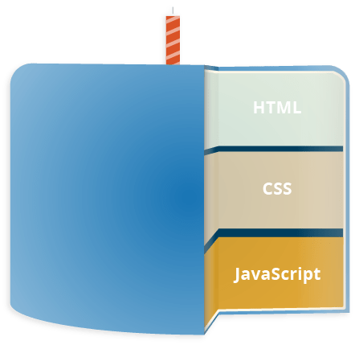

<style>
@import url('https://fonts.googleapis.com/css2?family=Prompt:ital,wght@0,100;0,300;0,400;0,700;1,100;1,300;1,400;1,700&display=swap');

    :root {
    font-family: Prompt;
    --hl-color: #D57E7E;
}
h1 {
  font-family: Prompt
}
</style>

# Principle of Being Professional

## Build Awesome Website with HTML/CSS/JavaScript/Netlify

---

# Setup


- VS Code
- Settings
  - Enable: Format on save
  - Extension: Prettier
  - Extension: Auto Rename Tag

---

# 3 Layers in Web Technology

- `HTML`: markup language
  - Defining structure
- `CSS`: stylesheet language
  - Apply styling to HTML content
- `JavaScript`: scripting language
  - Add dynamics to content



---

# HTML

---

# HTML

- HyperText Markup Language
- Standard markup language for documents designed to be displayed in a web browser.
- Can be assisted by technologies such as Cascading Style Sheets (CSS) and scripting languages such as JavaScript.

---

# HTML element


- Encloses parts of the content to make it appear a certain way.
- Consists of
  - Opening tag
  - Closing tag
  - Content

---

# Attribute


- Contain extra information about the element.

---

# Empty element

```html

```

- Two attributes
- No content
- Does not require `/` at the end.
- However, in React JS, this is required. Therefore you should write

```html

```

---

# HTML document

```html
<!DOCTYPE html>
<html>
  <head>
    <meta charset="utf-8" />
    <title>My test page</title>
  </head>
  <body>
    
  </body>
</html>
```

---

# `<!DOCTYPE html>`

- A required preamble (คำนำ).

```html
<!DOCTYPE html>
<html>
  <head>
    <meta charset="utf-8" />
    <title>My test page</title>
  </head>
  <body>
    
  </body>
</html>
```

---

# `<html></html>`

- Wraps all the content on the entire page
- _Root element_

```html
<!DOCTYPE html>
<html>
  <head>
    <meta charset="utf-8" />
    <title>My test page</title>
  </head>
  <body>
    
  </body>
</html>
```

---

# `<head></head>`

- Container for all the stuff to include on the HTML page that isn't the content you are showing to your page's viewers.

```html
<!DOCTYPE html>
<html>
  <head>
    <meta charset="utf-8" />
    <title>My test page</title>
  </head>
  <body>
    
  </body>
</html>
```

---

# `<meta charset="utf-8">`

- Set the _character set_ of the document to _UTF-8_.
  - Includes most characters from the vast majority of written languages.
- No reason not to set this.

```html
<!DOCTYPE html>
<html>
  <head>
    <meta charset="utf-8" />
    <title>My test page</title>
  </head>
  <body>
    
  </body>
</html>
```

---

# `<title></title>`

- Sets the title of the page
  - Browser tab the page
  - Bookmark/favorite

```html
<!DOCTYPE html>
<html>
  <head>
    <meta charset="utf-8" />
    <title>My test page</title>
  </head>
  <body>
    
  </body>
</html>
```

---

# `<body></body>`

- Contains all the content shown to web users
  - Text, images, videos, games, playable audio tracks, ...

```html
<!DOCTYPE html>
<html>
  <head>
    <meta charset="utf-8" />
    <title>My test page</title>
  </head>
  <body>
    
  </body>
</html>
```

---

# CSS

---

# CSS

- Cascading Style Sheets (CSS)
- Stylesheet language used to describe the presentation of a document written in HTML.
- Not a programming language nor a markup language.

---

# External stylesheet

`index.html`

```html
<head>
  ...
  <link rel="stylesheet" href="style.css" />
  ...
</head>
```

`style.css`

```css
h1 {
  color: blue;
}
```

---

# Anatomy


- Selector
  - Defines the element(s) to be styled
- Properties
- Property values

---

# Selectors

- Element selector
  - Also called a tag or type selector
- ID selector
- Class selector
- Attribute selector _(Skip today)_
- Pseudo-class selector _(Skip today)_
- Pseudo-element selector _(Skip today)_

---

# Element selector

- Select all `<h1>` elements

```css
h1 {
  color: blue;
}
```

---

# ID Selector

- Select the element on the page with the specified ID

```html
<p id="my-id">Text</p>
```

```css
#my-id {
  color: blue;
}
```

---

# Class selector

- Select the element(s) on the page with the specified class.
  - Multiple instances of the same class can appear on a page.

```html
<p class="my-class">Text</p>
```

```css
.my-class {
  color: blue;
}
```

---

# JavaScript

---

# JavaScript

- JavaScript is a scripting or programming language
- Allows implementation of complex features on web pages.
  - Content updates
  - Animation
  - Interactive maps
  - Audio/video contents

---

# Setup

- Add `<script src="script.js" defer></script>` in `header` tag.
- Create `script.js`

---

# Example 1

```js
alert("Hello World");
```

---

# Example 2

```html
<button id="btn">Click me</button>
```

```javascript
function createParagraph() {
  let para = document.createElement("p");
  para.textContent = "You clicked the button!";
  document.body.appendChild(para);
}

const button = document.getElementById("btn");
button.addEventListener("click", createParagraph);
```

---

# Example 3

```html
<button id="btn">Click me</button>
```

```js
const button = document.getElementById("btn");
button.addEventListener("mouseover", () => {
  alert("พี่ขาอย่าทับหนู");
});
```

---

# Sending Line Notify

```html
<input id="input" type="text" /> <button id="btn">Message Me</button>
```

- Get your Line Notify token [here](https://notify-bot.line.me/)
- [JavaScript code](https://gist.github.com/nnnpooh/2b051daec435b24bacff38959dc555ca#file-script-js)
- Proxy server https://cors.iecmu.com

---

# Deploy

https://www.netlify.com/
